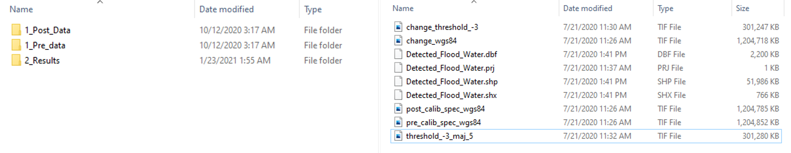
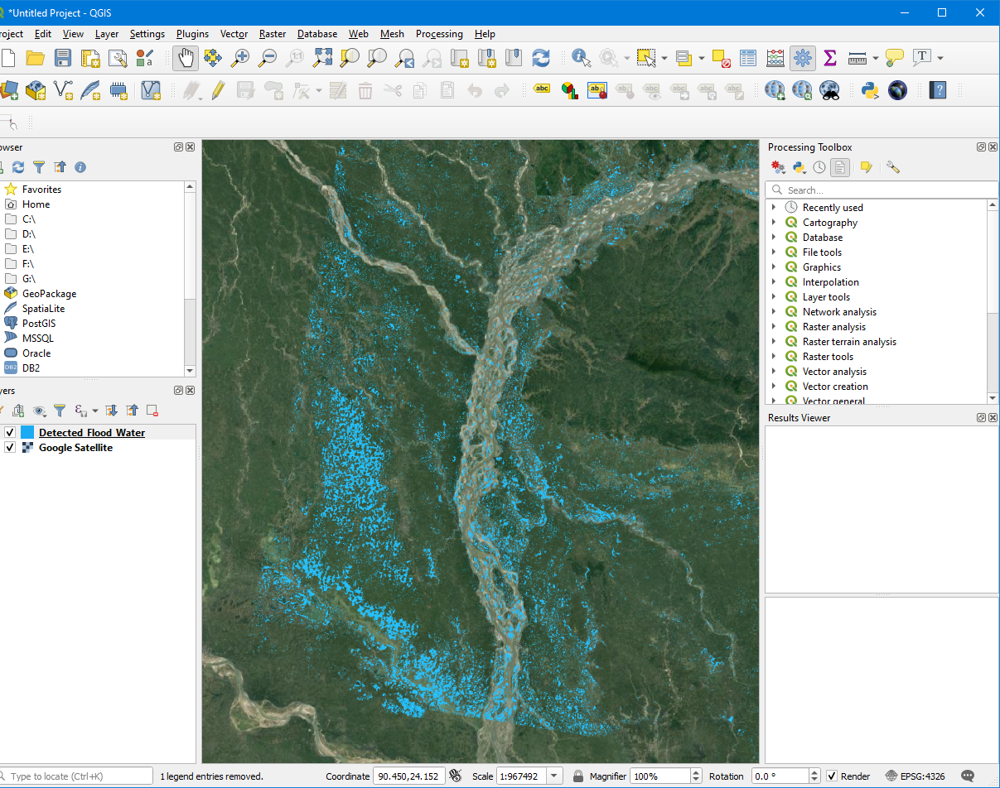

# Flood-Detection-ALOS2-SA
A Flood Mapping Approach ( Change Thresholding) Using ALOS-2 PALSAR-2 Synthetic Aperture Radar Data with Open Source Python libraries.

# Objective 
This script will give the user access to process ALOS-2 PALSAR-2 (Synthetic Aperture Radar) data to detect water areas after a disaster, especially a flood, typhoon, or storm.

# Functionality
This flood mapping approach gives the user flood water area detection ALOS-2 PALSAR-2 data based on threshold technique and it also capable of getting data from Optemis system 

Sentinel Asia and Optemis System

The Sentinel Asia (https://sentinel-asia.org/) is a voluntary basis initiative led by the Asia-Pacific Regional Space Agency Forum (APRSAF) to support disaster management activity Asia-Pacific region by applying the WEB-GIS technology and space-based technology, such as earth observation satellites data. When a disaster occurs, all earth observation data (Specially ALOS-2 PALSAR-2 data) will be available to the Value-Adder Organization through this initiative. In that case, all the satellite data will be provided for a system called Optemis (https://optemis.sentinel-asia.org/) which, is used to share earth observation data and processed results for Sentinel Asia Members.

The following scripts can also be used to acquire ALOS-2 Data from the Optemis system and process it according to the requirement. (Only post-event data/ Both Pre and Post data)
If the user dont have access to the system, they can input the ALOS-2 (in zip format) externally to the scripts and process. 
More details are described in the main two scripts.

Then the flood extraction is carried out according to the instruction of the Flood_Module_ALOS2.py file. This file includes the main processing steps such as change image generation, thresholding, majority filtering, and raster polygonization. (For both cases : Pre-Post/ Post only)

# Steps

1. Install anaconda

You can find the installation instruction from this Link.
https://docs.anaconda.com/anaconda/install/

After the installation,install the libraries mentioned below using Anaconda prompt.

    pip install glob2 DateTime GDAL numpy whitebox pathlib rasterio pprint36 zipfile36 paramiko re2 pytest-shutil

2. Running Scripts

The two main scripts (ALOS-2 Pre and Post image processing.ipynb and ALOS-2 Post image processing.ipynb) run in jupyter notebook environment and the Flood_Module_ALOS2.py can be placed in the same directory as the main scripts, or it can be placed in the Lib folder of the working anaconda environment (e.g.," C:\Users\User_name\Anaconda3\Lib"). 
Then you can import the Flood_Module_ALOS2 module to the main scripts. ALOS2_pre_post and ALOS2_post are two classes for the processing of the ALOS-2 data for flood/water detection.
 
    from Flood_Module_ALOS2 import ALOS2_pre_post
    
    from Flood_Module_ALOS2 import ALOS2_post

# Methodology

This below graph shows the method adopted in this approach. (Pre-Post/Post only)

# Output
The results will include the following;

* Processed pre-event and post-event tif files. (In 2_Results Folder)
* Threshold and majority filtered tif files. 
* Detected Flood water shp file.

Result Floder Structure

Output visualization on QGIS
